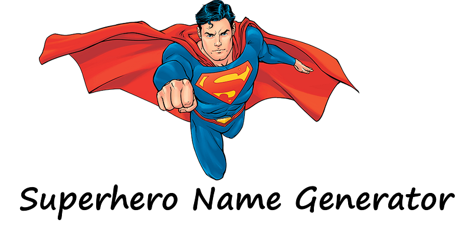

# Create a Superhero Name Generator with TensorFlow

    

Text generation is a common natural language processing task. We will created a character level language model that will predict the next character for a given input sequence. In order to get a new predicted superhero name, we will need to give our model a seed input - this can be a single character or a sequence of characters, and the model will then generate the next character that it predicts should after the input sequence. This character is then added to the seed input to create a new input, which is then used again to generate the next character, and so on.

In this guided project I have learnt -
- How to create a character level language model that will predict the next character for a given input sequence.

